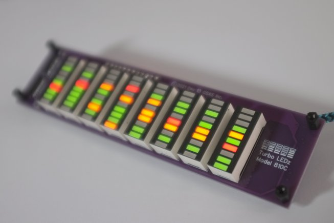

The TurboLEDz daemon supports the following models:

# TurboLEDz 88s

This model has 8 bars of 8 segments each.
This model is used to display cpu load, aggregated over cores.

[Tindie Page](https://www.tindie.com/products/stolk/turboledz-88s-cpu-load-graph-kit/)

# TurboLEDz 810c

This model has 8 bars of 10 segments each.
This model is used to display cpu core frequencies, one segment per physical core, and uses bi-colour LEDs that can be off/grn/ylw/red.

[Tindie Page](https://www.tindie.com/products/stolk/turboledz-810c-frequency-graph-kit/)

# TurboLEDz ODO

This model has 14 numeric LED displays, with 2 decimals.
It is used to display the life-time CPU usage, aggragated over all cores.
The value displays is compute-seconds.
It can count up to 1 trillion seconds.

The odometer value is stored locally, on you computer.
The linux daemon saves the odometer value between reboots in the `/var/lib/turboledz/odometer.state` file.

[Tindie Page](https://www.tindie.com/products/stolk/cpu-odometer/)

Pre-built drivers [are available](https://turboledz.com/drivers.html).

Daemon usage is described in [the README.md](https://github.com/stolk/turboledz) file.

