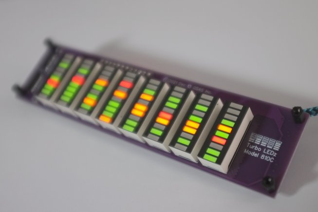
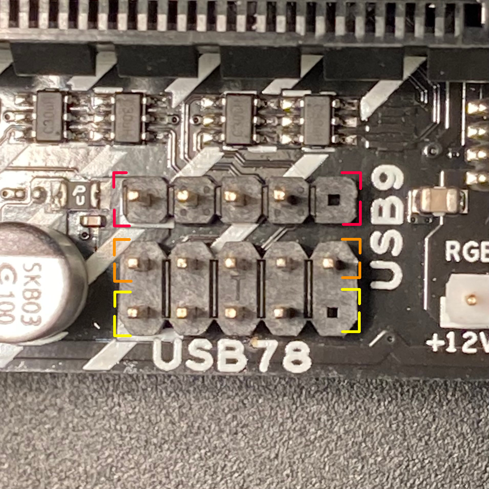
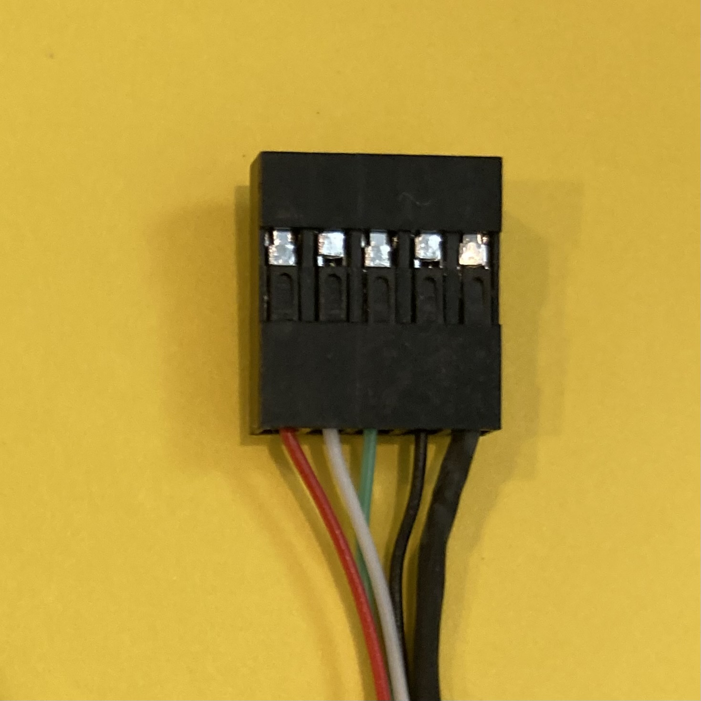

# turboledz
Daemon to control Turbo LEDz devices.




## Introduction

With the turboledzd daemon, you can display OS statistics, like CPU load, on a [Turbo LEDz USB device](https://www.tindie.com/stores/stolk/).

The daemon is typically started as a system service using:

```
$ sudo systemctl start turboledz
```

To see the configuration options, do:
```
$ man turboledzd
```

The turboledzd process is written in C and uses very little resources itself.
I've measured it to be sub 0.5% of a single core, for the non-optimized debug binary.
An optimized build uses even less.

When a Turbo LEDz device is plugged in, and the daemon has not yet send any data to it, the device will show a wave on the display.
This gets replaced by statistical data on the CPU load (and later: Core frequencies) when the turboledzd process contacts it.
When the host PC goes to sleep, the device will show the wave again on its display.

The daemon supports [several models](https://github.com/stolk/turboledz/blob/main/MODELS.md).

## Dependencies

This daemon depends on two system libraries. Before building, make sure you have those  installed:
```
sudo apt install libudev-dev libhidapi-dev
```

## Building (Linux)

To build the daemon, use:
```
$ make
```

To build and install a debian package, use:
```
$ make turboledz-1.1.deb
$ sudo dpkg -i turboledz-1.1.deb
```

## Running (Linux)

Turbo LEDz devices show up a rawhid devices in `/dev/hidrawX` which need to have user access `rwx`.
This can be automatically set with a udev rule.

You can run turboledzd straight from the command-line, as user, to test.
The Debian package will set up a systemd service, and run the process under the daemon user.

## Building (Windows)

Windows support is experimental.
Unlike the Linux version, it does not run in userspace, but as a service with elevated privileges.
You need to build libhidapi first.
The Visual C solution has 3 targets.

1. The service process itself.
2. The service installer (which creates the system service.)
3. The MSI install package.

The MSI install will run the installer and start the service after installation.
If anything goes wrong, examine the `c:/temp/turboledzinstall.log` and `c:/temp/turboledzservice.log` files.

Pre-built drivers [are available](https://turboledz.com/drivers.html).

## Plugging In

Even though a device can be plugged in with a regular USB to Micro-USB cable, installing the device in a 5.25" drive bay is done best with a 5-pin USB cable.
Locate the USB connectors on your motherboard, which are typically 9-pin or 5-pin.
For a 9-pin connector, you can choose either the top-row or bottom-row.
Depicted below is my motherboard with a 9-pin double port and a 4/5-pin single port.
You can use one of three to connect the device: either the red, orange or yellow annotated row.
Check your motherboard manual for orientation: The shielded cable goes to the unconnected pin-position.






## Known issues

**No hot-plug support:** The daemon will exit if no devices are found, and it will only use devices that where seen at launch. Currently it does not detect hot-plugged devices that were plugged in after the start of the daemon process.

## Copyright

turboledzd is (c)2021 by Bram Stolk and licensed under the GPL.

